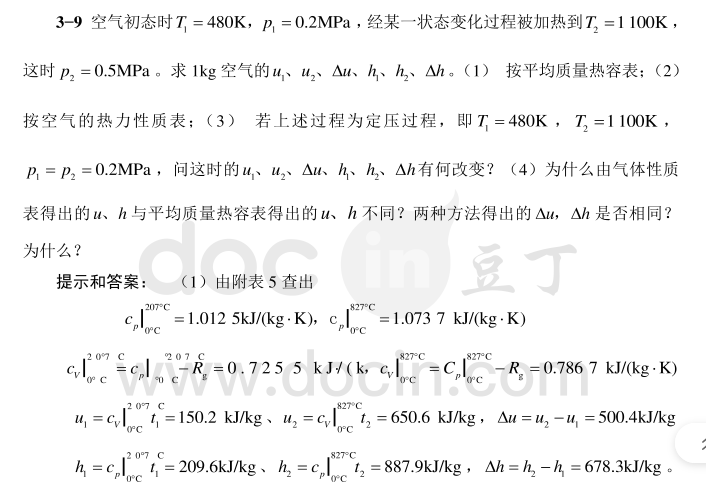
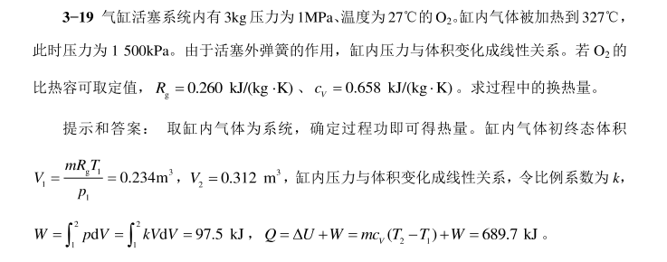

# 一 2024.3.12

一匹=735w

30w功耗才是绿色建筑 焓熵涌

宏观热力学和微观热力学

# 二 2024.3.14  基本概念及定义

Basic Concepts and Definition

没人擦黑板
热能动力装置：气体动力（combustion gas power plant）： 内燃机（internal combustion gas engine） 燃气turbine轮机 喷气jet发动机
｛蒸汽动力装置：
柴油400多的燃烧点
热力循环有正向和逆向

工质 substance medium 氟利昂 R－22 R 23  溴化锂 ？溴化氨 氨腐蚀管道 对铜管镀铜  氨易燃烧爆炸
1）膨胀性比较好
2）流动行好
3）热容量大  Q = CMのt  C   玻璃水
4）稳定性安全性
5）对环境友善  GWP 温室效应  wulia R11  当量温室效应
6）价格

内燃机 曲柄连杆 偏心轮 力矩不守恒 四冲程
蒸汽动力 国通（一个小锅） 进行气液分离
大气压1013000Pa       锅炉里的气压25－30Mpa  20个大气压
101.325Kpa  10 m水柱 760MM汞柱

## 热源

constant 恒定 heat ~热~ 温度 reservoir 源
variable 变温
冷源  heak   sink

土壤可以看成恒温热源 因为他无限大无论怎么取热都不会显著改变他的温度

## thermodynamic system  热力系统

人为分割出来的  *有限* 物质体系系统
surrounding 外界 （与体系发生质，能交换） boundary 边界

汽车  人体机械效率20%

复相系 水 加热 水和水蒸汽 成了复相系 加热变成了热平衡 就成了一个均匀的复相系

## 闭口系统

O）热力系统只有能力交换无物质交换
O）没有质量交换，能量交换无所谓不考虑 是闭口系统
控制质量CM

## 开口

simple compressible system 简单可压缩系统 可压缩物质组成
开口可以是绝热的 管道很长 热流体流入流出 管道很细  轴向和径向比较小径向忽略

## 状态的单值函数  数学上与过程无关

强度量 与质量有关  intensive
广延量  与系统比例有关 extensive property
广延量的比性质具有强度量特征  如比体积

用小写字母表示比参数

~越靠近地心压力越大  小？~

干度 和压力和温度没有关系的参数

系统的几大参数 P压强 M质量 UXX 㶲熵

temperature scale 温标

测温的基础 热力学第零定律？ 温度相同的定义为热平衡

简单可压缩基本条件 容积变化功 两个独立的状态参数相等

第四定律0k打不到

# 三 2024.3.19

三相平衡点？？ 水的固液气在0.01℃  细胞保存负70℃

知道某热力学温度和 ~熵值~ 三角形法则  算一元一次方程的表达式 就知道两个点 做 内插法

## 压力表 其实测的是压力差  物质的真实压力和环境压力差 表压力和真空度

绝对压力 表压力 gauge pressure 真空度 当地大气压 local atmospheric 某些可以测海拔？

1bar = 1x10 5      1atm = 101325Pa 760mmHg = 10M H2O  25个大气压电厂运行

## 已知 Pb = 1atm 汞柱差300mm B读数 0.2543M pa  压力表都与大气压做对比 是相对的压力读数

## 1.4 平衡状态和平衡方程

thermal equilibrium 热平衡 mechanical 力平衡 热力平衡的充要条件 state 状态

密闭水平衡 同时有水蒸发 有凝结 动态平衡

晾衣架 杵墙上 稳定但不平衡

## 准平衡过程 工质的状态变化过程

破坏平衡的势 无穷小过程进行得无限缓慢

工质有恢复平衡的能力

Pext E点的一个平衡状态

reversible process 可逆过程  O℃ + dt  可以过程必然是准平衡过程 准平衡只是可逆的必要

非准静态 不可逆

低一点 dt 对于0℃的水 是准静态 可逆 关键是把 水分成无情多份是准静态

### 可逆过程 是没有摩擦的准平衡过程 不应该有任何的耗散效应

不可逆损失 谁是可逆的

d表示微分 只有系统的状态参量
のta 表示微元过程了
△ 表示状态量发生了有限大小的变化

### 几种广义工 电极化功

## 过程功和热量

のtaW = Fdx W12 积分12 Fdx

功是过程量  功可以 用P—V图上过程线表示

## 热量 heat

仅仅由于温差而通过边界传递的能量

Q = 定积分 T dS 过程量
1B2 的过程是一个熵增加的过程是吸热过程 热量增加
放出热量 熵逐渐减少
一个直线上吐或下凹

一个热机 很自然 从高温吸收 传热到低温 并且 对外输出功  高温热源当作一个系统 他就是熵减

# 四 2024.3.21

## 热力循环是对这一章的总结

循环： 正向循环  逆向循环

reversible cycle and irreversible cycle  可逆和不可逆

动力循环 正向

膨胀线在压缩线上方 123 PV 图 顺时针进行 对外做工   345（1） 压缩过程

净功  ：椭圆的面积

在W－S 温熵图 也可以表示正向循环

## refrigeration cycle 制冷循环

冰箱里在逆向过程中有个膨胀管没有回收  节流阀（大管径变成小管径（毛细血管压力小  温度低））    压缩机   膨胀阀
细铜管 的节流阀后没回收膨胀功 （为什么不回收）？？？

制冷剂很少 4，500 g  毛细管多  膨胀管 多功细小 不回收了

341MN   Wnet 是个负的 压缩线在膨胀线的上方

## 循环经济指标

Wnet = Wt－Wp ？？  收益和代价

climbing  攀登 adj 有关的

# 五 2024.3.26

## 第一章作业 七道题

### p 35 1－2  1－7 1－8 1－9   写到俩张纸上 1－12  1－16 1－20

无期限作业

热力学第一定律表达式  热力学能  内动能 势能 化学能 原子能 气体的惰性有关 远离或靠近基准面

#### 加入系统的能量总和－热力系统输出的能量总和 = 热量系总存储的增量

### 闭口系的基本能量表达式

Q = のE + 一个中括号（里面是零）

### 真空度 绝对压力？？？

## 开口系能量方程

### 推动功和流动功

气体推动他   ？？ 系统吸收或排除工质的 做的功 力×距离

流动 系统花费代价维持流动所花费的代价
一段流入一段流出 他们都差值在系统里存在代价 流动的代价

## 焓

焓是焦耳 状态参数 引进或排除工质而输出入系统的总能量  工程中注重改变量 不在乎绝对值

## 技术功

技术上 可资利用 的功

### 你他们上课讲课怎么那么抽象 开口系统能量方程式

### 稳定流动能量表达式

### P52 讲了一个 充气的能力题  系统加入的能量

## 稳定流动能量方程式的应用

## 作业 P61   2 5 9  16  18  作为一次作业

# 六 2024.3.28

膨胀设备 他的能量方程 也是开口能量方程推到出来

进出口流速 势能 都忽略不计

### 换热器可以简化

顺流式换热

## 第三章  气体和蒸汽的性质

#### 理性气体的基本假设

#### 理性气体的状态方程 PV = mRT

三原子分子一般不能当作理想气体

氟利昂 和水  主要是弗拉格提供  这时水可以作为理想气体了

# 七 2024. 4.2

## 理性气体的热力学能和焓和熵

在等温线 等焓线 等热力学能线 他们是相等的

在pV图上 的 等温线 是向下凸的

可以选取参考 零焓点

### 理性气体的  熵 entropy

1KG 工质微元 可逆过程换热量 除以  温度

状态参数

## 主要是熵的三个方程

## 水蒸气的饱和状态 相图

## 第三章作业  P100 T3－5  T3－9  T3－11 T3－12 一次作业   T3－17  T3－18  T3－19

比定压热容 

### Rg是 **1 kg某种理想气体定压升高1 K对外作的功** 。

### 取 喷 管 为 控 制 体 积 列 能 量 方 程，忽 略 位 能 差

# 八 2024.4

you
fuck
