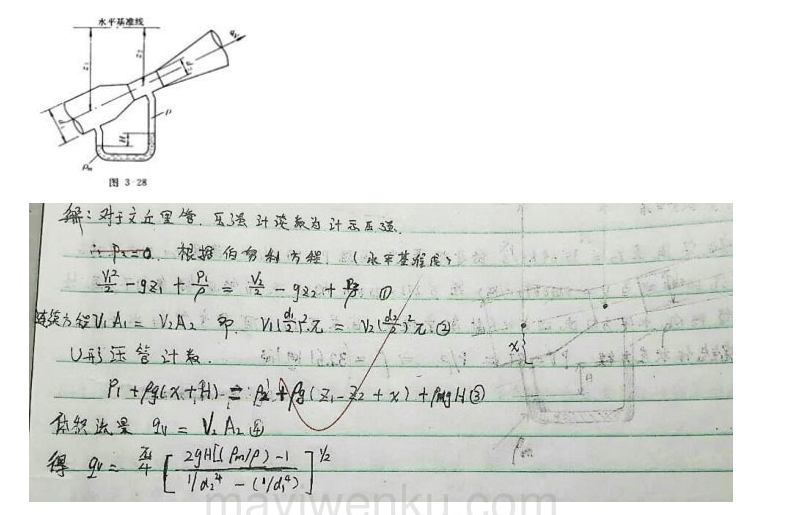
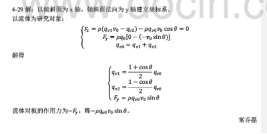
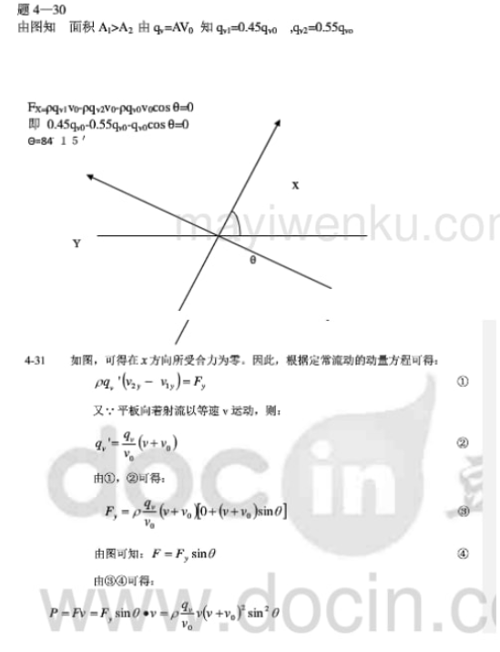
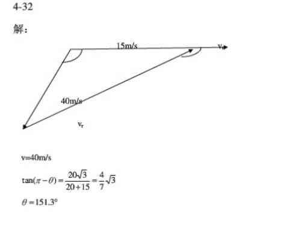
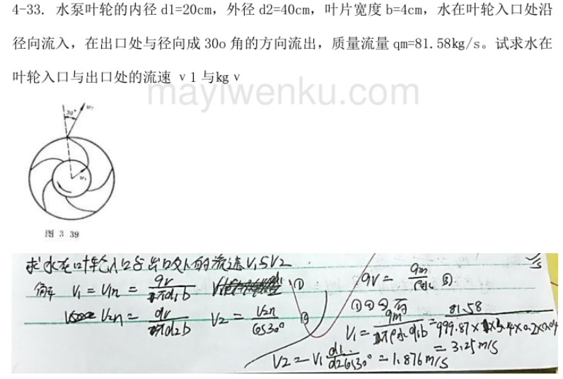

# 2024.3.11

56+8实验

fluid mechanics hydrodynamics

李海英 0677
10位  lhy12345678

大部分流体文题研究不了
只能在一纬的管道里算算

蒸汽轮机
4089
10.128.149.21某个地址

汽车：流体改进速度也上不去了流线 传热  尾部的吸力
高尔夫的外壳
老球好
公积金  火箭热量来自空气的挤压 空气突然停止动能转热
刘良旭D D2 417 18322703883
对流把摩擦的东西导走

# 二 2024.3.13

## 流体的连续的变形的假设

连续节制模型
粘性特征不一样，流体因此分为气体和液体

200℃油  融融盐naCl300℃太阳集热器真空管
4℃水1000kg/m3

—流体的粘性—

壁面无滑移理论 第一层而我在第五层 老千层饼了
相对第二层和第一层

动力粘度    个个动力系数的温度相关系数个个物体不一样

运动粘度

雷诺粘性系数

## 牛顿非牛顿     			黏性和理想

液体的表面张力

# 三 2024.3.18

王绍龙 新能源及利用的选修课  风力发电

## 流体静力学

线性微元 研究流体的点  连续介质模型

表面力，两个微元的作用力 流体如果有相对运动有粘性

质量力，力场作用在所有

建立一个方程来描述流体

流体的状态用prv表示粘度 ，还有时间T xyz

静止时无切向力，液体没有相对运动，没有粘性

流体静压强 流体内任意一点的压强

只有法相应力

1）作用于内法线方向
2）作用面在空间的方位无关，只是坐标点的连续可微函数

对于一个四面体的微元三脚题 pn＝F（px py pz）

所以p是关于xyz的函数

## 流体平衡方程式

欧拉平衡微分方程 等压面 力函数

还有时间T 压强P 速度V 密度肉

选六面体了，

# 四 2024.3.20

## 重力场中流体的平衡

欧拉方程非常负载，用起来不够方便 变形得到压强差公式

压强差： 公式  dp = 肉（fxdx + fydy + fzdz）

在重力场中作用在流体1中是质量力 （切向力？） 重力场 fx = fy =0 fz = －g
所以 dp  = 肉gdz

变换 dz + dp÷肉g = 0

静力学 速度为0 密度保持不变   X ====  积分 Z + p÷肉g = C 一阶 微分

对于一个液体中任意的两点 有流体力学 的 两个基本方程 Z1 + X = Z2 + X

~Z 代表重力势能是 流体的高等 C 叫~

几何意义 ： 位置水头 Z 加上 压强水头  合为静水头 净水头线

通常我们只计量 计示压强 A－A，

帕斯卡原理 p = p0 肉gh

## ~可压缩流体中的压强变化~  ~不考~  标准大气的压强分布

对流层 的压强衰减基本等于常数

在经过课本推导后 这个式子证明 对流层 还是关于高度的函数 函数p÷肉的n次方  = 1.235

10000m 20000 恒温层  t2 = 216.7K 还是一样的 只关于高度的函数

## 绝对压强  计示压强 真空  （名词解释）

绝对压强  已完全真空为基准计量的压强 P = P0 肉GH

计示压强 已当地大气压强为基准计量的压强 Pe = P － Pa =肉GH

真空 ：当被测流体的绝对压强低于大气压强时，测的得计示压强为负值 此时 流体处于真空状态

1） 工程大气压 9.80665 10000 pa
2） 标准 1.01325 100000 pa
3） 1巴 100000

# 五 2024.3.25

对于一个流体力学的问题研究1

通过一个微元  利用 欧拉方程  在重力场中研究

可压缩流体的压缩变化

找等压线 对等压线 两端的东西建立方程进行求解

绝对禁止 和 现对静止

## 液体的相平衡

水平直线等加速容器中液体的相对平衡问题 等角速度

写出压强差公式

fa方向 fb  fz 上有fg

的力 微元上的个个方向上的压强 进行体积积分 得到整体的压强差

等压面方程 －adx －gdz=0 积分得 屏面和X轴的夹角为 a= —arctg（a÷g）

### 边界条件的设置比较重要

P0 + pgh

流体对固体作用的力指导我们设计固体

### 等角速容器中液体中相对平衡

由于液体有粘性随着容器旋转

标准的抛物面？？

达朗伯原理 地球自转

r的距离是微分的 可以 rw2 进行向心力的计算

铸造有两种 浇筑和压铸  离心铸造减少气泡

离心式水泵 中间的真空度最高

转速离心力远远大于重力

难在作用在顶盖上的力

预习开头 第六节 静止液体作用在平面液体的总压力

### 静水奇象

# 六 2024.3 .27

p49   3—10 3—12 3—13 3—16  3—20  3—27    只能用作业纸

以微小的正六面体的质量÷上式 去极限 a处的平衡方程分 欧拉

### 压强差 等压面

### 平衡条件  势函数

等温流动 等熵流动

### 重力场中流体的平衡  帕斯卡 原理

### 静止液体作用在平面上的总压力

### 静止在 潜体 和 浮体

# 七 2024.4.1

描述 PV肉 T    XYZT 用这四个变量描述

静力学 不受时间的影响 不可压缩 温度恒定  无速度

## 流体动力学

### lagrange 拉格朗日

跟踪每个流体质点运动的全过程 记录

数学求解非常困难 流体的坐标 x = （a，b，c，t） 二阶导就是加速度

### 欧拉法

复习一下全微分？？

质点加速度  迁移加速度  质数全导数

微分算符？？ P23

复杂的全微分变成了 质点加上迁移

定常流动 偏V÷偏T = 0  均匀流动 迁移加速度为0

质点全导数 同样适用 压强 密度 速度？

## 要背 拉个朗诗 优缺点 直观性强  物理概念明确 缺点  作比较 名词解释题

## 流动的类型

定常流动 非定常流动

一纬 二维 三维

三倍以上的阻力 飞机的翅膀  吊起来三倍的阻力  起飞 300公里每小时

### 蓟县和刘娴  名词解释

流线 速度场 的矢量线

流管 流线不重合

急变流

四周 接触周长 用卡方表示

有效截面积 称为 有效水力半径

当地导数  当地加速度  迁移加速度 欧拉 的研究对象

# 八 2024.4.3

### 系统 控制体 运输 输运公式

两种流体的 运动状态

### 名词解释  流动 的 流体 实线的边界叫控制体  系统叫 虚线有表示 边界

正说反说 都对 很多的技术路线

系统的物理量随时间的变化率  控制体 进通量

物理量 是 质量 能量 动量 一踏 是n 长发n

给 一踏 不同的定义  dn 表示 物理量的变化率

输运公式 CS CV  CS1  CS2  CV是控制体内 和经过控制面的进通面 CS 的关系   这就是输运公式就推导出来了

对于定常流动 当地导数为0  CV 为0

### 流线 流管 有效截面积 名词解释

定常管流

# 九 2024.4.22

热二  研究方向  卡诺热机效率高  可逆(物理化学到这了)

动量方程和动量矩方程，微分算符

缓变流 急变流 的损失  动力 泵与风机 汽轮机

蒸汽轮机 被 取代了 燃气轮机 高温高压的烟气

# 十 2024.4.24

## 伯努利方程非常重要

## 作业  4-14 15 16   一次  4-29 30 31 34

https://max.book118.com/html/2018/1022/5044343341001322.shtm    26页

# 十一 2024.5.7
刘良旭
## 相似理论与量纲分析
等比缩放
欧拉和拉格朗日 三大方程

0.15分  本勾变形  力和形变之间的关系  各种比例尺
三个相似  时间 动力 还有
### 动力相似准则 

### 油有个铅位控制  防止气体进入 爆炸

# 十二 2024.5.9

相似准则数 不可能打成 想要相似 需要三个条件  重力流 粘性流

相似不行 用近似模拟实验
量纲一致性原则  瑞利法 有局限只能推导乘积的 用个π代替了 布金汉法 

相似的三个定律 相似准则数 

一个模型统一应用到所有 

冲量 dim就是量纲的意思 （∑Fdt）=巴拉巴拉  
动量 dim  这两个量的量纲一样
## 期末必考
请写出理想流体的伯努利总流的 流体方程 
粘性流体 

3.量纲分析法 研究物理量之间的函数关系 
我们行业定义了几个准则数

计算沿程损失的 达西魏斯巴赫 公式 Hf

期末不考 输出N跟水的 重量 流量 扬程H 齐次 相等 指数积关系式  量纲分析，都是证明题 飞机的托举力跟什么什么角有关证明 

热力学的多变指数 K 

π定理 瑞丽 不考 考研考

## 简答题 达到力学相似的三个必要条件

动力相似准则  

动力粘度的量纲
P89 简答题 量纲分析 

 

# 十三 2024.5.14

## 第六章管内流动 ， 液体出流  水力计算 五章合成了一章
粘性流体的一纬流动 呲水 

考研50% 70分 基本上   工程上85%  

甩水 虹吸 页面只要低于水头 就行

负压 水 管掐  拐歪出  地漏豹猫什

能量方程式 内能 动能势能 位置势能 压强势能 =常数

流动把换热和做工不考虑了  这章将的是 粘性流体  不是理想流体的静力学动力学  但包含  加上内能

内能 v方 z方向 压强方向  dA 跟体积  滑移 管内快 外壁慢

Va 平均速度  去代替真实速度 需要 动能修正系数 α = 层流2  紊流 1.03 － 1.01

能量方程式简化了 内能 不算你动能 和热力学一致的 流动过程中 只要有损失 位置不变 速度变下 内能增加  散失杨程抵消 郾城的损失

压力传递的速度 焓也是损失 u加pv 

## 必考 Z1 + P1/pg + a1

王老师讲了 动量修正系数

水的体积模量 水的压力波的速度 1480 m/s

水头守恒  

流体在流动的 两种  沿程阻力 Hf 局部阻力Hj  管材 管件

盐城能量损失 达西魏斯巴赫 兰姆达 系数 无量纲 跟雷诺有关 = f（Re,?） 

局部损失系数 贼她 

## 第二节 粘性流体的两种状态

壁面无滑移 粘上壁管

层流 是原来的两倍 的速度   仅限于层流

临界速度有两个方向 

层流的总速度小 粘性力 限制的住 

第一个思维方程 取对数 去研究

# 十四 2024.5

1