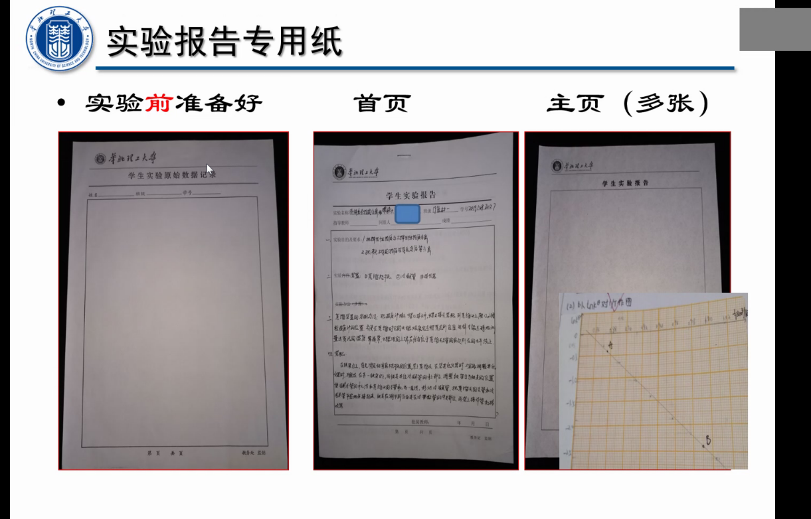
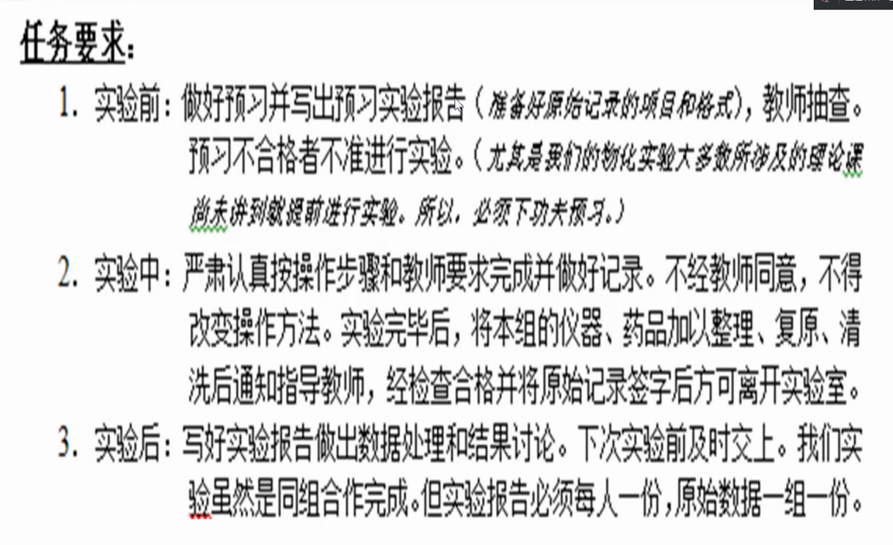
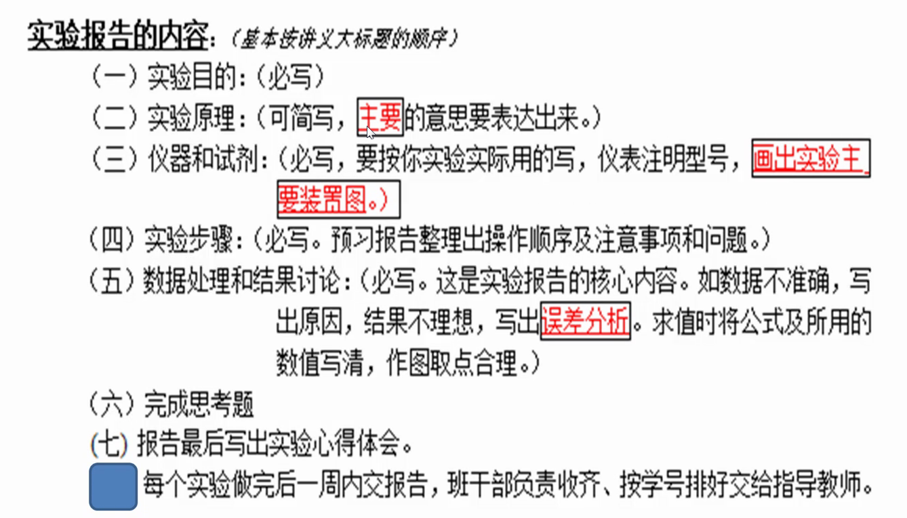
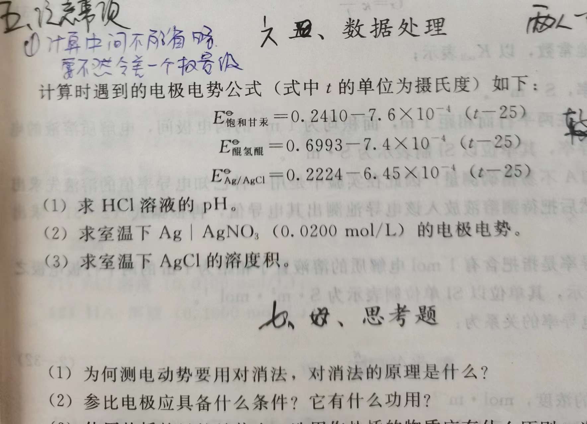

我们焊接电路板的时候经常需要用到含铅锡

锡烟

### 有铅焊锡

由锡（熔点232度）和铅（熔点327度）组成的合金。其中由锡63%和铅37%组成的焊锡被称为共晶焊锡，这种焊锡的熔点是183度。

**标准焊接作业时使用的线状焊锡被称为**[松香](https://baike.baidu.com/item/松香/0?fromModule=lemma_inlink)芯焊锡线或焊锡丝。在焊锡中加入了[助焊剂](https://baike.baidu.com/item/助焊剂/0?fromModule=lemma_inlink)。这种助焊剂是由松香和少量的**活性剂**组成。

**焊接作业时温度的设定非常重要。焊接作业最适合的温度是在使用的焊接的熔点+50度。烙铁头的设定温度，由于焊接部分的大小，电烙铁的功率和性能，焊锡的种类和线型的不同，在上述温度的基础上还要增加100度为宜。**

焊锡主要的产品分为焊锡丝，焊锡条，焊锡膏三个大类。应用于各类电子焊接上，适用于手工焊接，波峰焊接，回流焊接等工艺上。

没错，有毒！

但是你闻到的松香味无毒，主要是在你手上沾的焊锡的铅和你吸入的铅蒸汽。

用完焊锡必须洗手，过程中注意通风，减少焊锡蒸汽的吸入。

我们老师说现在的焊锡无毒，你妹啊，老子的焊锡卷上明明标注着pb37%，您用过焊锡没啊。

目前主流的焊丝为Pb、Sn工艺。也就是说，没有标注ROHS的焊锡丝都是锡铅合金的，这种含37%的铅。

你可以选择购买符合ROHS标准的焊锡，这样是无铅的，但是熔点高，不容易使用。

简单判断方法：用焊锡和手摩擦，留下黑色痕迹的是有铅的，留下黄色痕迹的是无铅的。实在不放心的买纯锡，一小坨花了我10块钱啊，不够我焊两次的。

[锡](http://baike.asianmetal.cn/metal/sn/sn.shtml)是人体不可缺少的微量元素之一，它对人们进行各种生理活动和维护人体的健康有着重要影响。首先表现在抗肿瘤方面。因为锡在人体的胸腺中能够产生抗肿瘤的锡化合物，抑制癌细胞的生成。此外，锡能促进蛋白质和核酸的合成，有利于身体的生长发育；也能促进血红蛋白的分解，从而影响血红蛋白的功能。还能抑制铁的吸收和卟啉类的生物合成，从而促进组织生长和创伤愈合，并能参与能量代谢。并且组成多种酶以及参与黄素酶的生物反应，能够增强体内环境的稳定性等。人体缺锡会导致蛋白质和核酸的代谢异常，阻碍生长发育，尤其是儿童，严重者会患上侏儒症。

正常来讲，如果按照国家标准进行防护与原材料采购，焊锡是不会造成重大伤害的， **现在基本上都使用无铅产品了** **。**

  金属铅可能产生铅化合物，全被归类为危险物质，在人体中铅会影响中枢神经系统及肾脏，铅对一些生物的环境毒性已被普遍证实。

  血液铅浓度达10μg/dl以上就会产生敏感的生化效应，若长期曝露使 **血液铅浓度超过60~70μg/dl就会造成临床铅中毒** 。

  有铅的肯定是有毒的，先别着急说他大不大，就是一般的金属，多了也会中毒。

  工作的时候，最好是**带口罩**，但多多少少还是会有影响。无铅焊锡丝，会比有铅的，安全得多。

    无铅焊锡有毒吗？

  锡与铅的合金，就是常用的焊锡，它具有良好的导电性，溶点又低，长期以来用于焊接工艺。焊锡的毒性主要来自铅，焊锡所产生的铅烟容易导致铅中毒。

  简单来说：**焊锡，含铅60%、含锡40%左右，所以焊锡本身是有毒性的。**

**员工平时可以看一下配发下来的锡是什么标识的** ，是属于哪一类的，这样可以有据可查及要求企业整改

## 电化学 测出来的电动势有什么用呢

0.2412饱和甘汞的电极电势
