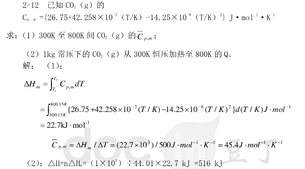
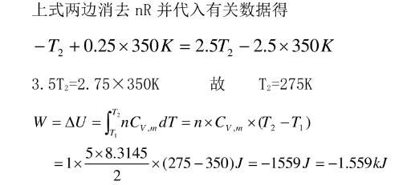
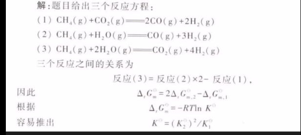
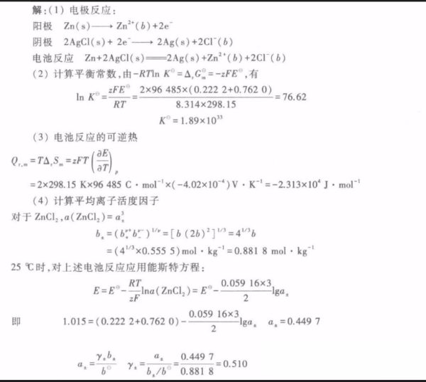
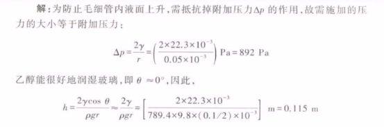
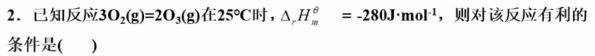

# 2024.3.10

15103350977 刘兵 化学工程学院 4465  密码很长
206－1 办公室化工楼
不能无辜缺勤3次取消考试资格
作业很重要

学科基础必修课
48学时3学分

气体的PTV性质，
热力学第一，第二，

## 过程性评价40分

journal of  Physical Ch

# 物理量的表示及运算

运算的时候带单位 ，
T = 298.15 k，
P =  101.325 kpa，

物理量用斜体 /N

同量纲的物理量才能进行-+x/

Xb = Nb/Nb+1mol
 	Xb可以没单位

V = nRT/P = 1mol x 8.314 J·mol -1 k -1 x 273.15K / 101.325x10@5 pa =2.479m@3 ·mol-1

v = xxxxx = ()m3·mol－1 =  2.47m3·mol－1

T 25 R 1.294kg/m3 运输压力是假设纯甲烷CH4

物质的凝聚（聚集）状态：气液固
PV=nRT 理想气体状态方程

## 经验规律

1662 波尔   1808 盖吕萨克

# 2024.3.13

R = 8.314  472j/mol·k
n = 273.15

Na=Nb 肉a=3肉b  Ma=0.5Mb（摩尔质量？不是1mol的质量吗 M=m/n）  求同容器压力比   压力比1比1
    a.n=（m/M）

物质的量相同

低于几十几百个千帕的气体在工程上通常是可以满足状态方程的

管道输出甲烷 压力200kPa T=25+273.15K 求肉
pv=nRT  1mol的甲烷的体积22.4 25℃ 压力1K千pa  代替法？
M甲烷 = 16.04/1000kg·mol
肉=m/v = m肉M/mRT = 肉M/RT
1.294

理性气体表示分子间没有相互作用力，分子本身体积不存在
实际上理性气体不存在
高温低压接机与理想气体

## 摩尔分数 体积分数

混合物的组成

V1=V2 的玻璃泡相连 空气101.325kPa，T=273.15K将其中一个球加热到100℃另一个维持0℃
解：物质的量守恒压力会变化但是压力处处相等，P1=P2 T变化两球物质的量移动，体积不变。所以0℃的只能变化物质的量来提高压强，另一个提高温度减少物质的量来提过压强

298.15K，刚性有co2和N2 pa=101.325kPa，co2分压56.18恒温下冲入N2总压升高到200kPa求分压co2（56.18）
体积和温度不变  物质的量与压力的变化，看物质的量的比值 关键体积不变
和他原来的分压一样 pb =def ybp
所以思路错了分压不变和物质的量呵呵

饱和蒸汽压是物质的本性 是温度的函数

## 道尔顿分压定律

对于混合气体无论是理想的还是非理想的都可以用分压的概念去描述他
其定义为

Pb=def  ybP   yb为组分B的摩尔分数 P为总压力  Pb也成为B的分压

期中对Pb进行在B上的求和？？ 就是各种气体的分压力之和

## 阿妈家定律

低压气体的研究

## 临界参数

某种情况下液相消失
TPV 临界
气体液化的必要条件：

作业1.2  1.3  1.6  101.325pa还有水蒸气

# 三 2024.3.18

4465  刘兵
LB ？？？？？？？？？？

## 理性状态方程

PV=nRT   p－pa  V－m3

## 热力学第一定律

0 1 2 3 定律

状态函数： 系统处于平衡态时，他在热平衡时他的参数是一个单值函数
非常重要 物质的状态的研究

相：相变 物质的状态

V = F（T，P） P是V的状态函数  异途同归，值变相等

体积功 (W = -F dl

恒外压Pamb   恒压   自由膨胀pamb是自己的压力变

广度量：与物质数量有关  强度量：与数量无关

功不是一个状态 是途径函数

H 由U+pv def 定义了吧 所以焓

## 反抗恒外压  Wa = －Pamb aV  =

## 恒外压只变化温度  状态函数啊哈哈

## 热是途径函数 就两个

# 实验物理化学

实验室紧张，时间紧张

报告非常严格，内容比较多

做实验B  二元凝聚物系相图  化工楼B4 219 东部   五六个小时？？

电动势及电极电势的测定  下册的第一张 215 一讲课

溶液表面吸附及表面张力的测定   215

过氧化氢催化分解  化学反应动力学 学化分解

## 设备

没看见

# 四 2024.3.20

热力学第一对真空扩散不做工 	内能不变 实验得到温度不变

内能U 对固液气来说 U只是对温度的函数

例题等温气体

课后系统 2.2 2.3 2.4  2.5  都用2mol   P92

## 恒容热，恒压热，焓

环境与体系之间的热Q交换不是状态函数 其大小与具体过程有关 但是在某些特定的条件，某一特定过程的热量Q却可以变成一定值，此定值可看做状态函数去算

# 五 2024.3.25

## 摩尔定容热容 比热

物质在恒容且非体积功为0
J/mol·K
热吗 能量过程函数，不能用全微分的形式

等体积和 质量  单原子 3/2R   双原子 5/2R
压力  5/2  7/2

恒压热容 这俩的关

H和U 是状态 不可测量 只能用のta  Q吸放热可以测 状态函数法计算

## 可逆过程和可逆体积功

将推动力小 体系与环境无限接近与平衡状态 的情况下 进行的过程 他并不存在

恒温膨胀中可逆功最大 系统对环境做最大功

P79 页 有点意思 很多能量都浪费了

# 六 2024.3.27

#### 热力学第一定律结束了

### 相变焓 相 在一个系统内

系统内物理性质，化学性质完全相同的均匀部分

相晶转变

啥也没学到

# 特别篇 一 物化实验 二元相图

迁河西被密封在罐子里，一点也泄露不出来，就天天在那当数据抄写员

# 七 2024.4.3

### 画第二章知识框架图  课后题 2.12 2.26 2.31  2.32 2.38

[https://www.docin.com/p-2327975877.html](https://www.docin.com/p-2327975877.html)

### 第三章 热力学第二定律

# 八 2024.4.22

写到流体里去了

# 九 2024.4.25

热三规定了熵的基准 越无序越大

A和G 函数 亥姆霍兹 吉布斯

# 十 2024.4.24

## 作业3.9   3.11   3.14  3.15

[https://www.docin.com/p-2327975877.html](https://www.docin.com/p-2327975877.html)   文章已被删除 狗日的资本 老子就是开源之神

熵和焓的计算怎么一个 ln  一个是Q吸收放 c定压摩尔热容

绝热可逆也不懂

这就能求出初始温度？

# 十一 2024.5.6

热力学方程和麦克斯韦关系式

H = U +pV
A = U －TS
G = H － TS
dU = Tds － pdv

四个基本方程  适用于不做非体积功的封闭系统

例子 封闭系统 恒T 的PVT都变化
dA = －Sdt －pdv  dG = －SdT +Vdp
得 dAt = －pdV  dGt = Vdp

对于理性气体将pv = nrt 带入积分 有 のAt = －nRTln（v2－v1）
のG ==

## 作业  思维导图第三章 题3.49

[https://www.chem.pku.edu.cn/huangjb/wlhx/xtskt/index.htm](https://www.chem.pku.edu.cn/huangjb/wlhx/xtskt/index.htm " 北京大学")

5.2  5.4  5.15  5.16

# 十二 2024.5.27

## 重点啊  F 最大自由度 === －P组分数 －相数  +  自变量（温度 压力）

稀溶液的依赖数的性   只跟分子溶质数量有关  4个依数性

拉乌尔定律 1.蒸汽压下降 2 凝固点 下凹  3 渗透压   4沸点 升高

## 相律分析

## 重点  二元组分气液相

对于二元 P至少为1

# 十三 2024.5.29

相率表达式 自由度F = C －P	+2

## 作业 画第五六章作业图

15 个选择题 30分 三个简答题10分30分 三个大题

前六章测验 三四节

# 期中复习

PV = nRT  括起来就写一个大单位  道尔顿定律

第二章没大题 其他有 第一定律 能量守恒 解决过程功能量的衡算问题
第二		过程进行的方向判据
第三		解决物质熵的计算  好像特殊要记                 纯物质  完美晶体  0K 时  熵为0 S=  亥姆赫兹啥  A ==def==  U  －TS   三个判断发生反应的三个
第四
第零		热平衡原理

问你以下哪些是途径函数 选择题  U H P V T

绝热恒容的系统的 U 是什么？

1）恒温过程 のU = 0  U只是T的函数  有用强调

2）恒压过程

3）恒容  W =0

4）绝热  Q = 0

5）自由膨胀过程

功和热是途径函数

Q =のH  封闭系统 恒压

恒温可逆膨胀
恒外压 可逆膨胀 Wr=nRT ln XXX

一定温度指的是25℃

稳定相态单质本事  的  标准摩尔生成焓 为 0 のf  Hm =  0

吉普斯自由能一定算

第四章  多啥量

拉乌尔 溶剂

蒸汽压一定会下降

亨利  溶质

稀溶液  或者理想溶液

稀溶液的依数性  ：依赖与溶质分子的数量  与性质无关

相关化学1反应标准平衡常数 做题用  K=K?/?K

三个 吉普斯是剪  就是除

惰性气体  对平衡无信息 印象

二1组分系统  P至少为1

 Vm表示气体摩尔体积  定压比热容，用符号**C**p

状态函数：系统处于平衡态时的热力学性质（如U、H、p、V、T等），是系统状态的单值函数，称为状态函数。 Q W  为途径函数

 吉布斯  还木活字 是U -TS       理想气体的U 只是T 的函数

◼ (A) 沸点升高
◼ (B) 蒸汽压升高
◼ (C) 熔点升高
◼ (D) 凝固点升高

# 十四 2024.6.2

# 十五 2024.6.17

作业7.14（123问） 7.24  10.3  第七章知识

11.3    8  11 29

# 期末复习

1mol理想气体在恒定压力下温度升高1C，求过程中系统与环境交换的功？

室温下，某理想气体的Cp,m/Cv,m=1.4，则该气
体分子为0         双原子分子

（1）从同一始态出发，理想气体经可逆和不可
逆两种绝热过程： 可能到达同一终态

（2）一可逆热机与另一不可逆热机在其他条件
都相同时，燃烧等量的燃料，则可逆热机拖动的
列车运行的路程：   较长

留给你做

PC1,的分解反应是PCIs一→+PC1,+CI，在473K达到平衡时，PC1有48.5%分解，在573K到达平衡时，有97%分解，则此反应为(

简单 吸热             两个温度下相同是什么鬼

    降温生压       负的焓应该放热反应

   3	1	0	2	1

冰水共存  C=1	P=2	F=0

C=1			P=2		F=0

#### 2、将极少量两种非挥发性的溶质溶于一种溶剂中，形成的溶液与这种溶剂相比较时：） 沸点升高

B.蒸汽压升高
C.熔点升高
D.凝固点升高   都不对

#### 二组分系统可以有哪些对应的自由度和相数组

合？最多有几个自由度？最多有几个相共存？请
写出解答过程？

4
