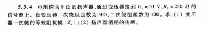

# 2024.3.11

electrotechnics & electronics B
3.5  56学时

两个大题直流电 交流电一个  50%平时成绩  1－7  11 12章学一点

直流10 瞬态6 交流 12  供电和用 6
变压 6  电动8 电气自动控制8
习题有4

秦zeng huang 电工学简明教程 第三版

## 直流电路

有源无源网络      二端网络（有两个端口）

4mm2大电流  6A一平方mm

电位：将单位的正电荷到参考点所消耗的电能
电压：单位正电荷某一点到某一点所消耗的电能
电动势：非电场力将单位正电荷

断开s可以看成一个电池加上内阻

# 二 2024.3.14

工频50hz超过10ma直流超过50ma触电着难以拜托电流

理想有源电气
电流源 标电流方向  恒流源两端电压由外电路决定  恒流源并联电阻 （什么吊玩意） I=Is－Uab/Rb 符号是一个禁止通行的园  先确定Uab的大小（原则电流电压不能变）

不能串联，必须相同小的烧坏

电压源 标正负 方向均恒定 外电路负载对其电源没有影响  这不屁话吗  变化量  电流可变化

并联不行小的烧坏

# 三 2024.3.18

谁输出功率，要假设电流方向

电压10V  电流2A  问2欧电阻 走五安   电压源电流可变

电源的关联参考方向，考虑电流是给电源提供能量还是电源提供能量  －－电流方向和电压方向一直是关联方向

非关联源起电源作用

## 铅酸电池

电池串联只增加电压不增加电流   充电器标称充电电流1.8A 对多串电池。  而用一个内阻测试仪 （各种电池标准协议？）先不管了， 最大放电电流 130A 对单个电池12V12Ah的蓄电池。他什么结构啊凭什么充放电电流能差距那么大。

## 热车 熄火之前空踩两脚油门

## 冬天充电效率低？？

可以等效互换  实际电压元 串联电阻  实际电流源 并联电阻 实际不能互换  实际内阻看成相同的？？就能互换了

太阳能板常并联一个  续流二极管？？  每一小片

电流源并联直接加和了，草也就能做题

## 电动车充电器的纹波？？

## 线性电阻与非线性电阻

1）碳膜电阻最常见 金属膜 缠绕上额额 五色发 四色发  分段电组 有的意思设计
2）水泥电阻 功率电阻可以走大电流 水泥散热
3）可变电阻 电位起 里面有个划片

电学6种结题我只学3种

测电流源的电压，电压源的电流

电压源是直线

## 基尔霍夫定律

KCL 电流定律 KVL 电压定律  看回路算电压电压到零

第一种  node 结点 电路中三个及以上的电路源气间  电流具有连续性，不能堆积电荷。
KCL 流入等于流出
可以应用到任意封闭面

## 为什么你的电源纹波那么大

电源纹波测试过大的问题通常和使用的探头以及前端的连接方式有关。首先检查了用户探头的连接方式，发现其使用的是如下面左图所示的长的鳄鱼夹地线，而且接地点夹在了单板的固定螺钉上，整个地环路比较大。由于大的地环路会引入更多的开关电源造成的空间电磁辐射噪声以及地环路噪声，于是更换成如下面右图所示的短的接地弹簧针。
https://zhuanlan.zhihu.com/p/498604635?utm_id=0

## 回路和网孔

回路很重要，没有回路就没有电流
未被其他支路分割的是网孔

KVL  电压的总和就是0

# 四 2024.3.19

#叠加定律

线性电路，多电源

# 常见电子元器件

RS585就是我要说的那个口

## mos管

MOSFET 是mos的一种类型

金属 metal  氧化物oxide 半导体semiconductor 场效应晶体管  source源级和drain漏级可以对调  在多数情况下这两个引脚性能一样那么这个期间是对称的

N沟道箭头指向G栅集 一共四个引脚    做阻抗变换   就三个角了

耗尽层和  增强型是三个方块做的衬底  压控型二极管

## 三极管

流控型器件，功耗大

## 稳压二极管

## 电压表

# 开关电源和线性电源的区别

线性电源变压器降低 全桥整流过后 电容滤波  效率低发热严重反之

开关电源见得多 5V会增加一个50MV的较大纹波 可以并联一个齐纳二极管 中断器有很大的峰值噪声串联磁珠

# 五 2024.3.21

留作业 画思维导图

P30 1.8.1

# 六 2024.3.26

## 戴维宁等效电路

画出等效电路 的有源二端网络才能用我们算出来的电压

57欧

### 电压源变成导线 电流源变成断路

## 诺顿不讲了

## LM2596S

输入3之30V 常见的DCDC稳压芯片

## 非线性电阻电路

### 不讲BJT MOSFET 金属氧化物

## 电路的瞬态分析

# 七 2024.3.28

P30 1.8.1

#### 陶瓷电容 104  10x10的4次方微法

电容 w = C di ÷ dt
    w = L di ÷ dt

串联可以增加耐压值

色环电感 四色环 两头有小啾啾？ 五色环四色环

### 因为功率不能无穷大所以电容要充电

### 问题 电火花主要是因为电流大还是电压大 ，还是因为 电感的感抗  还是电容的容抗 电阻的阻抗

# 八 2024.4.2

## 时间常数陶  =  RC   ==R/L

## 一阶电路的f（t）  = f（无穷） +e的负陶分之t次方

换路定理的暂态

独立初始值

Ric + Uc = 0  根据KVL 基尔霍夫电压

Ic = C du ÷ dt

得 RC du ÷ dt + uc = 0

得到UC的通解  uc = A e 的负 什么次方

将t=0 的到系数A 得到u零

在零输入  全响应  零状态

三要素 的 公式

掏 一个套 0.368 三到五个掏

时间常数

## 续流二极管的作用？？ 机理

## 磁化现象？？？

# 九 2024.4.7

等效电流法 把电容称出来  除源法 把电压源看成导线

掏 时间常数  RC  L÷R 在一阶电路的角度上 看 有源二端网络

充电的电容的曲线  电容的充电是无穷大的吗 D值

### 第二章思维导图

## 交流电

标幺值  相量

# 十 2024.4.23

两个大题 一个从第一章直流电路

## 向量法

IP5513 9080.1rc

10bit ADC 188数码管或者4－1颗LED  内置5V输出  同步整流1功率管内置 最大300ma 升压效率93%  1.5MHZ 频率  只是耳机仓 最大500ma充电电流

多种保护 过流 短路 过压 过冲 整机过温 ESD 4KV  VIN 瞬态耐压15V

一定是同频率的电流才能比较相位差

# 十一 2024.5.7

## LM2596S恒流恒压电源模块

输入电压7－35v 输出1.25－30v  最大电流3A  最大转换效率92% 开关频率 150KHHz 纹波50mv

可用于固定稳压设计  包含内部频率补偿  和一个固定频率震荡器 最大+—4% 的公差

U = j Xl I感抗 2πfL 无功功率var
1/wC  容抗  U = － j Xc I
T= 1/欧米伽  一秒 的圈数 是次数 倒数是频率？？？ 1/2πf C

# 十二 2024.5.21

实验

与直流电路中的电压关系相比，交流电路中的电压关系存在显著的不同。

在直流电路中，电压的大小和方向始终保持恒定，没有周期性变化。这意味着直流电路中的电压是恒定的，没有频率和相位的概念。因此，在直流电路中，各个元件（如电阻、电容、电感等）的电压关系主要是基于欧姆定律和基尔霍夫定律等电路基本定律进行计算的。

然而，在交流电路中，电压的大小和方向会随时间呈周期性变化。这种变化通常以正弦波的形式表示，具有振幅、频率和相位等特征。在交流电路中，电压的变化不仅与电路元件的阻抗特性有关，还与电压的频率和相位有关。因此，交流电路中的电压关系比直流电路更为复杂。

具体来说，交流电路中的电压关系包括以下几点：

1. 振幅关系：交流电压的振幅是指其时间内的最大值或最小值，也就是电压的峰值。在交流电路中，各个元件的电压振幅与电路中的电流振幅、元件的阻抗以及电压的频率和相位等因素有关。
2. 频率关系：交流电压的频率是指其周期性变化的次数，也就是单位时间内完成的周期数。在交流电路中，电压的频率与电路元件的阻抗特性有关，不同频率的电压在电路中的传播和分布也会有所不同。
3. 相位关系：交流电压的相位是指其与参照信号的时间差，一般用角度表示。在交流电路中，电压的相位关系对于电路的稳定性和性能至关重要。如果电路中的电压相位关系不正确，可能会导致电路失稳、振荡或损坏电路元件等问题。

总之，与直流电路中的电压关系相比，交流电路中的电压关系更为复杂，需要考虑电压的振幅、频率和相位等因素。因此，在分析和设计交流电路时，需要更加深入地理解交流电路的基本原理和特性。

考试

阻抗角    电流超前阻抗  135°  只考虑  	功率负值   功率因数角 是45° 的cos 就根号2除以2 了

# 十三 2024.5.23

星形连接  相电流和线电流是相同的  向量好像没关系

线电压等于根号3倍的相电压 （不是

三角接发 没有公共点 无中性点

线电压和相电压是相等的  线电流和相电流 看向量图 向量表示其实很方便

三相负载 考虑 对称性的 电类学非对称的负载

负载也有星接和角接  三相电负载均匀 中性线无电流  因为向量关系 三相上的阻抗一样 均衡存在

中性线不允许断开

三相功率

例题  380 p 75w   fa =1  y形连接求电源提供的电流 由线决定 几平方  求线电流  s=根号3倍的 l  相是3倍的

# 十四 2024.6.6

三相异步交流电动机

变压器的等效阻抗 不明白

Ze = K方R =200Ω

三相电源 相电源 有100w电阻 接到线电压上 根号3的平方 3倍

对称三相负载3W  星形改   三脚性  功率变9W

n = （1－s） n0   转速和转差率的关系

外串电阻可以改善  电机的启动性能

启动大电流 转矩小   大电流对电网影响

# 十五 2024.6.18

新来的老师讲的很好但我都会

哈哈

0
